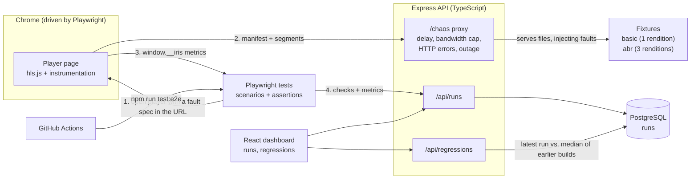

# Iris: Instrumented Reliability in Streaming

[](https://github.com/marlware/iris/actions/workflows/ci.yml)

Iris plays real HLS streams in Chrome, breaks the network on purpose, measures what the viewer would experience,
and flags builds that got worse. Playwright drives the browser, hls.js plays the stream, results go to PostgreSQL
and show up in a React dashboard. Iris consumes HLS; it doesn't encode. ffmpeg is only used to generate test fixtures.

## How it fits together



A test run, step by step:
1. A Playwright test opens the player page with a stream URL like `/chaos/bw=600/<token>/abr/master.m3u8`. The fault spec is part of the path, so it also applies to every relative segment URL in the playlist.
2. hls.js plays the stream while `web/src/instrument.ts` records startup time, stalls, errors, recovery time, seeks and quality switches.
3. The test reads those metrics from `window.__iris`, evaluates its checks, and POSTs the result.
4. The server compares the newest run of each scenario with earlier builds and the dashboard highlights regressions.

## Scenarios

| Scenario | Fault | What it checks |
|---|---|---|
| baseline | none | startup, no stalls, no errors |
| latency | +400 ms per request | still plays, startup bounded |
| low bandwidth | 400 kbps cap, single rendition | stalls show up, no fatal error |
| transient segment error | segment 3 returns 503 twice | recovers, recovery time |
| missing segment | segment 3 always 404 | failure is reported, not hidden |
| unavailable manifest | manifest returns 503 | fatal error, no first frame |
| seek (x2) | none / +400 ms | seek to unbuffered, backward, forward; resume time and landing position |
| ABR clean | none | climbs to the top rendition |
| ABR throttled | 600 kbps cap | stays on low renditions without stalling |
| ABR bandwidth drop | 500 kbps cap after 4 s | player steps down, bounded stall |
| connection loss | every connection dropped 4 s to 16 s | stalls, then recovers once the network is back |

## Regression detection

For each scenario, the newest run is compared with the median of up to 5 passing runs from other builds
(`GET /api/regressions`, logic in `server/src/regression.ts`, unit tested). A metric is flagged only when it is at least
1.5x the baseline and also worse by a minimum absolute amount, so small baselines don't produce noise.
To fake a slow build locally: `IRIS_BUILD=build-3 IRIS_EXTRA_SPEC=delay=1500 npx playwright test` from `e2e/`.

## Run it

```
npm install
npm run fixture      # generate fixtures/ (HLS test streams)
npm run db:up        # PostgreSQL on :5433
npm run test:e2e     # starts API + web, runs every scenario, stores results
npm run dev:server   # then, in another terminal: npm run dev:web -> http://localhost:5173
```

Needs Docker and Google Chrome (Playwright's bundled Chromium has no H.264). Unit tests: `npm run test:unit`.

## CI

`.github/workflows/ci.yml` runs typecheck and unit tests, then the full Playwright suite against a Postgres service
container. The build id is the commit SHA and the HTML report is uploaded as an artifact. Each CI run starts with an
empty database, so regression comparison currently only works against a local database.

## Layout

- `server/`: Express + pg REST API, fault-injecting stream server (`chaos.ts`), regression logic
- `web/`: React + Vite; results dashboard at `/`, instrumented player harness at `/player`
- `e2e/`: Playwright scenarios
- `scripts/make-fixture.mjs`: builds the HLS fixtures
